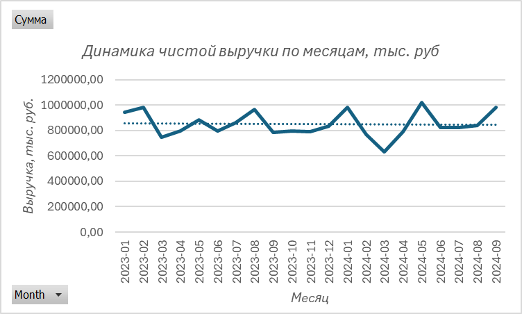
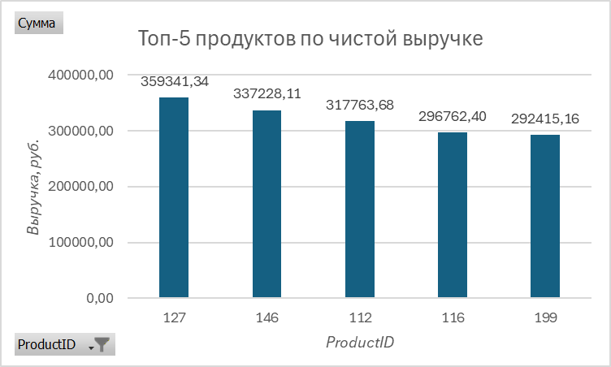

# Анализ продаж (Excel-проект)

**Очистка данных · Сводные таблицы · Визуализация · Бизнес-выводы**
 
## Цель проекта
Проанализировать продажи за период январь 2023 – сентябрь 2024, выявить ключевые продукты, категории и динамику по месяцам.

## Исходные данные
- Период: 21 месяц
- Общая чистая выручка: 17 834 767 руб.
- Количество категорий: 7
- Количество продуктов: 99

## Результаты анализа

### Общая динамика продаж (график)

**Выводы по графику:**
- Максимальные продажи: май 2024 (1 020 000 руб.)
- Минимальные продажи: март 2024 (629 000 руб.)
- Общий тренд: слабоположительный

### Топ-5 продуктов

| ProductID | Выручка |
|-----------|---------|
| 127       | 359 341 |
| 146       | 337 228 |
| 112       | 317 764 |
| 116       | 296 762 |
| 199       | 292 415 |

**Вывод:** топ-5 продуктов дают 9% от общей выручки. Ассортимент диверсифицирован.

### Выручка по категориям

| Категория         | Выручка   |
|-------------------|-----------|
| Books             | 2 826 341 |
| Toys              | 2 765 362 |
| Health & Beauty   | 2 669 576 |
| Clothing          | 2 407 758 |
| Sports            | 2 406 867 |
| Home & Kitchen    | 2 389 517 |
| Electronics       | 2 369 347 |

**Вывод:** категории распределены равномерно, разрыв между лидером и аутсайдером — 2,5%.

## Выводы по проекту
1. Общая выручка за 21 месяц — 17,8 млн руб.
2. Самый высокий месяц — май 2024, самый низкий — март 2024.
3. Топ-5 продуктов приносят лишь 9% выручки (высокая диверсификация).
4. Категории сбалансированы, нет явного доминирования.
5. Рекомендуется проанализировать причины спада в марте 2024.

## Инструменты
- Excel (Power Query, сводные таблицы, графики)

## Файлы проекта
- `data/sales_data.xlsx` — очищенные данные
- `analysis/pivot_tables.xlsx` — сводные таблицы
- `images/chart_monthly.png` — график по месяцам
- `images/chart_top5.png` — график топ-5 продуктов

## Автор
Трухина Регина

## Дата
Апрель 2026
